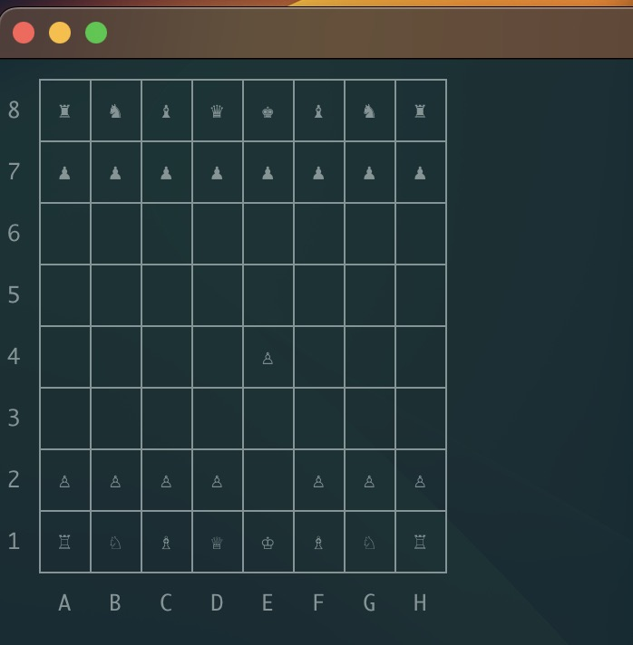

# Chess-Terminal
Play Chess in your Terminal

## WIP
### TODO:
- valid moves
- move your pieces

### TODO: eventually
- play against yourself
- chess engine as opponenet (stockfish + own)
- lichess
- other users through tunnel connection